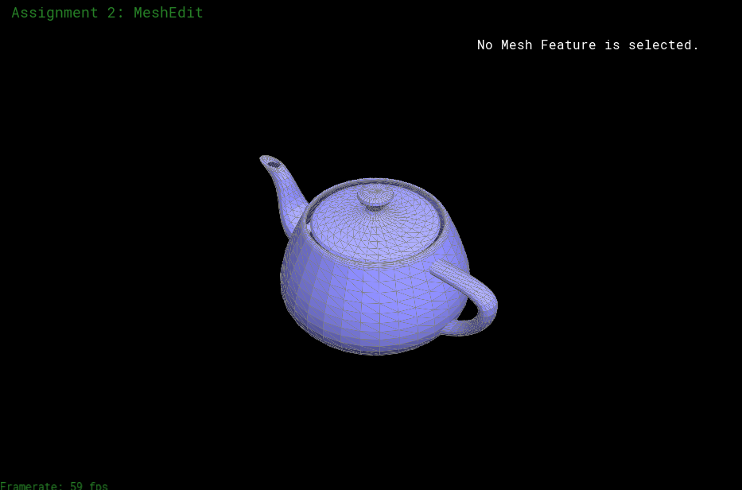
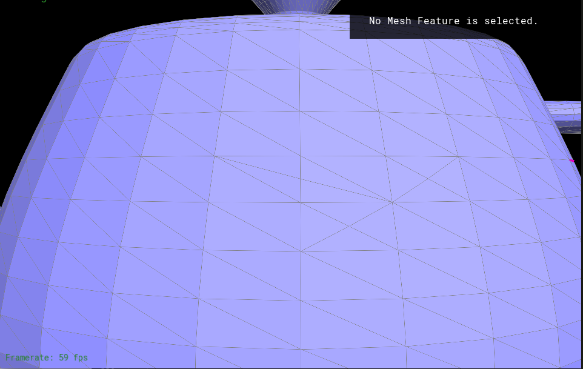

## Chase Porter  |  CS 184

This project was focused on a few key ideas for drawing polygon meshes, mainly Bezier Patches, Upsampling, and shading. To create a Bezier Patch I essentially use Bezier interpolation across two directions of a 2D set of Control Points. Following this I create two functions for handling flipping and splitting edges that are later used in upsampling which consists of two steps: first splitting every edge, and then flipping appropriate edges to make the mesh more uniform. Finally I shade my mesh with both Phong shading and environment mapping.

### Part 1: Fun with Bezier Patches
Part one implemented a Bezier Patch over a set of control points to create a surface mesh. To create the mesh essentially Bezier curves were mapped across a 2D array of control points, some curves spanning the columns and some the rows. This was done with to variables, u and v, to represent the parametric parameter of the curve in either direction. In general, given an array of 16 control points, the algorithm will create a "patch" that touches the corners of the array and stretches towards the other control points. In our example we incremented u and v both by an eigth at a time from 0 to 1 generating a total of 81 points on the mesh in total and a 64 square mesh. The squares were then divided into 2 triangles creating a final mesh with 128 triangles.

To implement the Bezier patch I had to take a double sum over the values u and v could take on and multiply the particular Bezier curve for a u value with the Bezier curve for a v value. I chose to do this with matrix multiplication. I first created a 4x4 matrix B to represent the coefficients for the bicubic Bezier Polynomials. A row vector of [1 u u^2 u^3] multiplied by this matrix and then mulitplied by the 4x4 matrix of Control Points creates a weighting of the patch along the u direction. Multiplying this by B's transpose (because we want the Bezier Polynomials to be for the opposite v direction) and then finally by the column vector [1 v v^2 v^3] gives a Point for u,v on the mesh. This process can be simplifed by simply combining the three middle matrices which are known from the beginning (B, control points, B transpose) into a single matrix. This is what I do in the preprocess step of studentcode.cpp. I have to make a different one of these matrices (BezierMatx, BezierMaty, BezierMatz) for the respective x,y, and z values of the control points which are each used to compute the x, y, and z positions on the mesh. In evaluate I use BezierMatx, BezierMaty, and BezierMatz to compute the x, y, and z coordinates of a given u and v. Finally in add2mesh I loop over all values of u and v, evaluate them, and store the results in a 9x9 array of vectors. I then go through the array and add the appropriate triangles to the mesh using the addTriangle function.

The two biggest roadblocks I encountered in this part of the project was realizing I would need to use three different matrices for the x, y, and z coordinates. To get a better understanding of the formulas in the notes I read many online resources for Bezier Patches and found the following to be the most useful: [Bezier Patch Matrix Formation] (http://www.idav.ucdavis.edu/education/CAGDNotes/Matrix-Cubic-Bezier-Patch/Matrix-Cubic-Bezier-Patch.html). The next road block was a bit of a head-bang-against-a-wall error. As far as I could tell I implemented everything correctly, even went so far as to check by hand the values I should have been generating for the matrices I calculated in the preprocess step, but I was still getting an error converting polygons to halfedge mesh. What I did not realize was that vertices are defined in a clockwise order and the order of the vertices inputed to addtriangle had to be as well. The results of finally getting this part to work are shown below.


```
Rendered teapot mesh: View 1
```

```
Rendered teapot mesh: View 2
```

### Part 2: Average normals for half-edge meshes

In this part we computed for every vertex an approximate average normal by taking a weighted sum of the normal of the faces that surround it. This helps to smooth out our mesh because it creates a normal on the boundary of faces that may face different directions that is an average of all the faces that surround it, helping make the transition less sudden. The grunt of the work around this part was in trying to understand how the HalfEdgeMesh class worked. Essentially, each edge is defined by halfedges that correspond to the faces on either side of the edge. These halfedges point to other halfedges that define the same face in such a way that calling next 3 times on any half-edge returns back to the original halfedge (assuming all faces are triangles as we do in this assignment). Each halfedge has a vertex associated with it, which essentially corresponds to the vertex that the halfedge points "out" of. Similarly, each vertex has a halfedge associated with it, which corresponds to any halfedge that points out of it. All halfedges have a twin which belongs to the same edge but points out of the vertex the halfedge points to and belongs to the opposite face.</p>

Using this information, a weighted sum of the normals of the faces of a vertex can be computed by taking the cross product of the two vectors formed from the vertex to the other two vertices of every face surrounding the face. This can be done by finding the vertex of the twin of the halfedge, call this twin h, out of a vertex and the vertex of the twin of the next of h. Taking a the cross product gives a weighted sum of the normal of the face by the definition of the cross product. To find the unit normal I just next had to divide this sum by its maginitude. After doing these steps I got the following results:


```
Failed Normal Averaging View 1: Can see the normal points inside teapot
```

```
Failed Normal Averaging View 2: View from within teapot
```

The error seen above was caused because I took my cross product of my vectors in the wrong order causing my normal vector to point inside the teapot rather than out. Switching the order of the vectors in my cross product fixed this problem and produced the following results: 


```
Corrected Normal Averaging View 1: Before averaging
```

```
Corrected Normal Averaging View 1: After averaging
```

```
Corrected Normal Averaging View 2: Before averaging
```

```
Corrected Normal Averaging View 2: After averaging
```

## Part 3: Edge Flip

In part 3 we implemented a way to flip the edges that separated a four by four polygon into two triangles such that it was now split by two different triangles. For example, consider a square A-B-C-D that was split into two triangles A-B-C and C-B-D by the edge A-D. If we were to flip the edge A-D to instead be BC, the square would now instead be split by the two triangles A-C-D and A-B-D. This feature is useful for upsampling where we try and make all triangles in our mesh as uniform as possible but splitting introduces edges that would be more uniform if they were flipped.

Implementing Part 3 involved keeping track and reassigning the appropriate pointers to keep the mesh consistent and accurately reflect the change in the edge that we want without losing pointers to any elements. As an example I will take again the edge AD as defined above. To change this edge to CB I have to look at AD's half edge ADh as well as its twin DAh. In this example, ADh has a vertex at A, a next halfedge of DBh, and a face represented by the triangle ADB. Similarly DAh has a vertex D, next ACh, and face ACD. In order to flip the edge, ADh has to be changed in one of the two ways: 1. Its vertex reassigned to B and its next to CD. On top of this DBh's next (originally BAh) must be assigned to DAh, CDh's next (originally ADh) must be assigned to DBh, DBh's face must be assigned to DAh's face, and DAh's face's halfedge must be assigned to DAh (to ensure the face is preserved as DAh's face). 2. DBh's vertex reassigned to C, its next reassigned to BAh, BAh's next (originally ADh) must be reassigned to ACh, ACh's next reassigned to DAh, BAh's face reassigned to DAh's face, and DAh's face's halfedge reassigned to DAh. Whichever option is chosen for ADh, the other option must then be chosen for its twin DAh. In this way I implemented Edge flipping. At this point however I did not rely on the setNeighbors function, I only allocated the pointers for each halfedge that I thought changed, as well as the pointers for the components that changed. This resulted in the following renderings for edge flip tests: 


```
Part3: Face Disappearance
```

As seen above, at this point my flip function would lose faces when I flipped edges. The only cause to this I could think of was that I must be losing track of a pointer somewhere. Therefore I went back over carefully specifically where I assign the two face pointers to a halfedge, and instead of updating only the components I thought had changed for each individual halfedge, I called setNeighbors on each one to update all of its pointers. This fixed the holes I was getting after edge flipping.


```
Corrected Part 3: Flip examples
```

```
Part3: Cube edge test pre flip
```

```
Part3: Cube edge test post flip
```

It is worth noting at this point that while my algorithm appeared to be showing the correct behavior there was an unseen error involving allocating the pointer for the halfedge for the vertices that only appeared in the massive flipping that had to done for part 5 later that caused incorrect behavior in my implentation of that part. What would happen is sometimes one of the halfedges of the edge I was flipping would be the halfedge to one of the vertices to the original edge. Once the edge was flipped however, it didn't make sense to keep the pointer for the vertex to the same halfedge. However, because this did not come up in my limiting testing of Edge Flip, I moved on to the next part. For later debugging in part 5 I realized this and came back and fixed this error.

### Part 4: Edge Split
The goal of this part was to implement a way to split edges which would be used to upsample a mesh and create more triangles to round out and smooth over the features. For example, consider an edge separating two faces. If this edge were split, there would now be four faces to represent the two on either. Essentially a midpoint would be created along the edge, splitting it into two, and from this point two new edges would be added connecting it to the two points the original edge never touched. Much like the last part this involved careful tracking of the pointers and their reassignment on top of the added complication of creating new edges, halfedges, and faces and assigning pointers to each of them. It quickly became a headache to keep track of it all.

To try and break this part into smaller parts I first tried to get the edge to halfway split, in that the edge would still be split into two, but I would only make one two new edges and one new face to split only one of the original faces in two. The aim was to try and reduce the number of pointers I had to keep track of while I was still trying to figure out a basic plan of attack. In the first few lines of the function I also defined all my original components. I defined the Polygon I was working with as ABCD, defined my input edge e0 to connect B and C originally, defined h's halfedge to be rooted in B. Then I defined all the other halfedges I would need, CA, AB, BD, DC (CA meaning the halfedge goes from C to A). The first step of splitting an edge was to create a midpoint vertex along it. After doing this I next contracted the original edge so that it lost one of the original vertices it connected and now instead touched the new vertex I created. I did this by taking the halfedge, h, of the input edge, e0, and setting its position to be the new midpoint vertex,m, position. Next I set m's halfedge to be h. This set an edge from m to an original vertex C. I then worked on creating an edge from m to the other original vertex B. I created a new edge, mb, and two new halfedges for it, mbh and mbh1. Mbh, and all halfedges later defined that didn't end with a 1, I defined for myself to point out of m. Similarly Mbh1 and halfedges like it would point into m. I set Mbh's vertex to m and Mbh1's vertex to the B. I set mb's halfedge to mbh. I now had edge going from m to C and m to B. Next I created another new edge ma that would span from m to A. I also created mah and mah1. I rooted mah1 at vertex A, and Mah at m. With this new edge I could now create the next relationships that would define my two faces mca and mab. H's next was already set to ca so all I had to do to define mca was set ca's next to mah1 and mah1's next to h. I then created the next relationships for mab as follows: mah->ab->mbh1->mah. To actually create this face I made a new face element called mab and set its halfedge to mbh1.
 
 At this point I hit an error where everytime I tried to split an edge I would get a segment fault. I didn't realize that by creating new elements that were somewhat integrated into my mesh, if their pointers were not fully defined, i.e. each had a next, vertex, face, etc. that later in the actual drawing of the mesh it would seg fault. This took me a while to find because in my debugging I found that in each call to my function it would proceed to the end of the function without segfaults. After looking on Piazza and finding people encountering the same problem. To handle my pointers as carefully as possible I ended up just rewriting the code again and like part 3 using the setNeighbors function rather than updating the individual parts I thought had changed. After fixing my segFaults I found splitting an edge would cause me to just lose the face I was working on entirely. 
 

```
Part4: Face Disappearance
```

It seemed like despite how carefully I checked my pointers to get rid of my segFaults I was still losing a pointer to a face somewhere. After carefully reviewing the components for each pointer I found that the pointer to h's face was getting lost in the event that its halfedge was not h itslef. Therefore to fix the hole in my mesh all I had to do was assign h's face's halfedge to be h. Now my split edge implementation was halfway complete and I got the followig results.


```
Part4: Progress
```

To split the remaining face, I just had to follow the same procedure I did for the first half but for a new edge md and using the h1->mdh->dc->h1 to make face mdc and mbh->bd->mdh1->mbh to make face mbd. Because I had a reference for the first half, this process went pretty smoothly and produced the following the results.


```
Part4: Success!
```

```
Part4: Complicated Edge Splits, splitting edges multiple times
```

As seen above, the algorithm successfully split edges multiple times and at this point seems to be working well. Like for part 3 however it is worth mentioning that there is an uncaught error that will cause errors for me in Part 5, but has yet to cause any problems in my implementation. </p>

### Part 5: Upsampling
   
The purpose of upsampling is to create an approximation of the mesh and its vertex values (rather than an interpolation like the Bezier Patch) that introduces more triangles and thus a finer mesh to smooth out a lot of the features. It does this by splitting every edge in a mesh and then flips new edges that connect any new point created with an old point (minus the new edge that runs along the same direction the original edge did). The Upsampling also updates the positions of the vertices using a weighted average of the positions of a vertex's neighbors. Also, unlike in split where the position of a vertex was determined with the midpoint of the edge to be split, the new vertex's position is also computed with a different weighted average. The formulas used to determine these positions are as follows:
 ```
 new_pos_of_old_vert = (1 - n*u) * original_position + u * neighbor_position_sum
 ```
Where n = vertex degree and u = 3/16 if n=3, or 3/(8n) otherwise.
For an edge connecting points AB on a polygon ABCD, the position of the new vertex created to split the edge is computed with
```
position =  3/8 * (A + B) + 1/8 * (C + D
```
To actually implement this, I first started by computing all new positions of the old vertices by iterating through all the vertices of the mesh. To compute the neighbor_position_sum I implemented the function computeCentroid in halfEdgeMesh::Vertex. This function takes h, originally set to v->halfedge, and adds to a running sum h->twin()->vertex()->position, representing the value of a neighbor vertex. I then update h to be its twin's next's twin, ensuring h still points out of my v, and its twin is attached to a different neighboring vertex. I continue to sum these values until h reaches its original starting halfedge. At the end I divided by the degree of v, so when I call this function in Upsampling I remember to multiply back by the degree to get my sum. Then using the formula specified above I compute my new position for v, but do not update it to this position but instead store it into v->newPosition. I also mark ever vertex's isNew parameter to be false.

Next I do a similar process for each edge e in the mesh where I find the value of the vertices of the polygon ABCD that it divides. I define A and B to be the vertices of e's two halfedges and C and D to be the next's twin's vertex of each of e's halfedges. Then I use the second formula specified above to calculate the position of the new vertex created which I store in e's newPosition function. At this point I also updated SplitEdge to at the end update the new vertex m that is created to store a passed in e's e->newPosition in m->newPosition. I also mark every edge's isNew parameter to be false.

Next I again iterated over every edge in the mesh and split it if its isNew parameter was false. In splitEdge, every new Edge I created I immediately updated its isNew parameter to be true. This prevents this step from infinitely dividing edges that are newly created.
 
At this point I ran the mesh on the teapot to make sure everything was dividing correctly before moving on to flipping and updating my vertices and got the following correct results: 


```
Part5: Splitting every edge
```

Next came the biggest headache of the project, getting the correct edges to flip after flipping every edge in the mesh. Originally I just tried to flip every edge that was new in the mesh connecting an old vertex and a new one. However that produced the following error:


```
Part5: Incorrect Flipping
```

This error came from the fact that not every new edge created in a split should be flipped even if it connected a new and old vertex. Specifically the new edge I created that ran along the same direction as the original edge I was flipping should not be flipped. This created all kinds of problems for me to think about when it to trying to figure out a way to determine if an edge ran along the old edge or not. At first I tried to check its halfedge (which I made sure to point out of the new vertex m in splitedge) h's next()->twin()->next()->edge() was an old edge. I thought this should work because I use the old edge as one of my edges in split edge and if only one edge was split then doing this would lead back to the old edge if the edge ran in the same direction. However because multiple edges were split, this wasn't always a gurantee and this created more errors. Eventually I fixed this problem by creating a new boolean variable in halfEdgeMesh::Edge called sflip and within my Split function since I know which edges go where I can set sflip to be true if an edge did not run along the original edge. Then when flipping edges I just had to additionally check to see if its sflip variable was true. This flipped my edges correctly, but introduced me to a new bug where I would occassionally lose a face.


```
Part5: Losing Face
```

```
Part5: Losing Face
```

By now I had become very familiar with losing faces and knew it had to be a misplaced pointer somewhere but could not find where. I spent many hours looking over both flip and split trying to identify it. Not being able to find it for a while I did some "creative" pointer reassignments that produced some interesting teapots that would not hold tea very well.


```
Part5: Lots of faces gone
```

Eventually I just rewrote my Part4 entirely and being extra careful and this time it worked. Now I just had to update every vertex position to be its new position. Unfortunately this created two new dilemnas that I had to solve. Firstly, my teapot now had a crown and weird displacements of the handles. It also had weird dents in it the higher I sampled. The first problem did not appear in the torus, cube, or icosohedron, but the second did.   


```
Part5: Teapot dents and crown
```

```
Part5: Dents in torus
```

After slaving over pointer errors I prayed this wouldn't be another pointer error, but for the second problem, it was. As it turns out I never reassigned the halfedge pointer for the vertices in Flip or in Split. This meant that a vertex might potentially point to a halfedge that was no longer connected to it. The first error was much easier to trace: before updating all the values of my vertices in the loop I just had to check and make sure it was not on the boundary. After doing this my Part 5 finally worked correctly! :D 


```
Part 5: Teapot Upsampling
```

```
Part 5: Torus no upsampling
```

```
Part 5: Torus 1 upsampling iteration
```

```
Part 5: Torus 2 upsampling iterations
```

```
Part 5: Torus 4 upsampling iterations
```

### Part 6: Fun With Shaders
In this part I implemented Phong Shading and Environment Map Reflection in GLSL.

In Phong Shading, in general, you compute a Light vector for each pixel that is a sum of three different light components, ambient, diffuse, and spectral, and use it to compute a color for the pixel. The shading I implemented makes the teapot look ceramic with a light gloss finish. To implement this I only dealt with the diffuse and spectral components. I first computed vector v from the eyeposition to the vertex of a given pixel using v = (eyePos - vertex). Similarly I then computed the vector from the light position to the vertex with l = lightPos - vertex. Using these two vectors I computed a diffuse lighting with the following formula where n is the normal to the Vertex.
```
Ld = kd(I/r^2)max(0,n*l)
```
For simplicity's sake I kept I/r^2 a constant because the teapot is a relatively small scene without much change in r. Also in this formula the constant kd (defined between 0 and 1) helps define how "shiny" or "matte" the surface of an object is. The lower this constant the more matte the surface will appear. I chose to set it to a midrange value .75. To compute the spectral shading I had to compute a bisector, h, of v and l by taking the sum of v and l and dividing by the magnitude of the sum. I then calculated the spectral component of the light vector with the following formula:
```
Ls = ks(I/r^2)max(0,n*h)^p 
```
This formula essentially calculates approximately how far off our current view is from the reflection angle of the light source. Like the last formula I likewise chose to keep I/r^2 a constant and ks helps define the overall shininess of the surface. P however defines essentially how closely v has to be to the reflection angle of l to create a strong spectral highlight. A higher p will create tighter spectral highlights.

To finish the implementation I added Ls and Ld and multiplied it by a general color vector for my teapot.

I originally forgot to include the max function in both of these formulas which produced the following for my Phong shading:


```
Part 6: Incorrect Phong shading
```
    
Because I had forgotten the max function, If the dot turned out to be negative, indicating it faced away from the light source, My program would then assign a value to L and symmetrically shade my teapot as if a light source was on either side of it. After adding the max of 0 and the dot product, if the angle turned out to be negative my L would be 0 and shade the pixel with shadow.


```
Part 6: Correct Phong shading
```

```
Part 6: Phong shading view 2
```

Next I had to implement environment map reflection. Essentially this maps a texture onto a surface as if it were reflecting a scene. To start, like with Phong shading I first computed my vector v defined the same as above. I then computed the reflection directon of the of this vector v with the following : 
```
rdir = 2.0*dot(v, n)*n - v
```
    
This represented the vector I would use to map onto a given texture to compute the value of a pixel, as if I were looking at a tiny pixle sized mirror angled towards the texture. In order to correctly map into this texture however I needed the spherical coordinates of my computed rdir. I defined theta to be the angle off the x axis with respect to the y axis my vector pointed. I computed this with atan(rdir.x, rdir.y). I defined phi to be the angle off the z axis with respect to the y axis. This angle is equivalent to topmost angle of the triangle formed with the vector, the vectors projection onto the xy plane, and the vector formed connecting these two vectors, which is parrallel to the z axis. Thus, phi = arctan(atan(sqrt(pow(rdir.x, 2) + pow(rdir.y, 2)), rdir.z)). Finally to access the correct coordinate on the texture I simply had to use (theta/(2PI), phi/(PI)). This created the following results which look really cool.


```
Part 6: Environment Map Reflection view 1
```

```
Part 6: Environment Map Reflection view 2
```

As you can see the teapot looks like it is made of a highly reflective metal surface.

### Part 7: Design you own mesh

For my own mesh I constructed both Weilun's mesh man as well as my own personal creation. I tried to create this image of [Majora's Mask](http://zeldawiki.org/images/thumb/d/de/MM3D_Majora's_Mask.png/200px-MM3D_Majora's_Mask.png) from my favorite video game series Legend of Zelda, but found it a little challenging. Instead I opted to make a turtle shown below. :D


```
Metal Mesh Man
```

```
Turtle Mesh: basic
```

```
Turtle Mesh: 1 subdivision
```

```
Turtle Mesh: several subdivisions
```

```
Turtle Mesh: Metal Turtle
```
